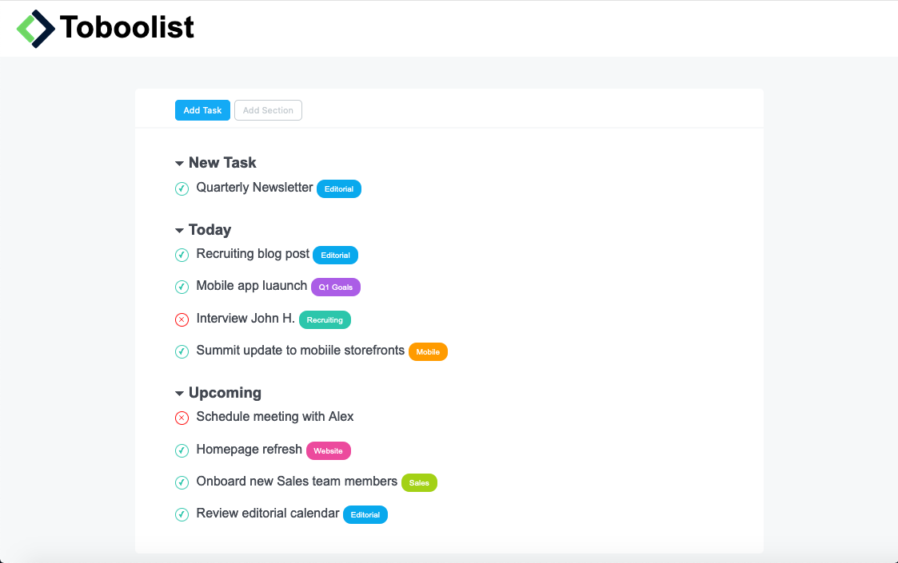

# ✅ Toboolist

This project is a simple **to-do list web app clone** called *Toboolist*.  
It was built as a practice exercise to improve HTML and CSS skills, focusing on layout structure, typography, and UI components.
🌐 [View online version](https://michecosa.github.io/html-css-toboolist/)

## Technologies used
- **HTML5**  
- **CSS3**  
- **Google Fonts** (Roboto)

## Features
- Header with logo and project title  
- Buttons: *Add Task* and *Add Section*  
- Tasks divided into three sections:
  - **New Task**
  - **Today**
  - **Upcoming**
- Circular check ✔️ and cross ✖️ icons styled with CSS  
- Color-coded labels for task categories (*Editorial*, *Q1 Goals*, *Recruiting*, *Mobile*, *Website*, *Sales*)  

## Styling
- Main font: **Roboto** from Google Fonts  
- Task status indicators styled as circles using `border-radius: 50%`  
- Category badges with different colors for visual distinction  

## Reference + used images

